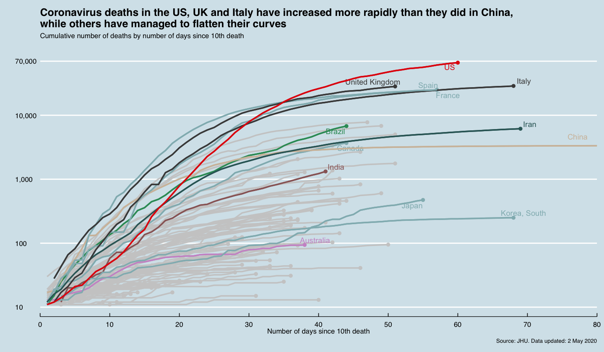
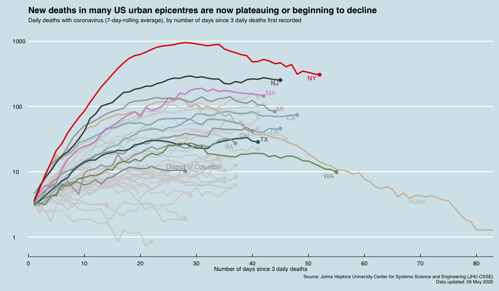

## COVID19-Timeseries-Data-Viz
This tutorial was developed for recreating two of the most classic Financial Times coronavirus trackers using JHU time series data in R. 

## Things you need to know about the graphs
First of all, viruses spread exponentially, that’s why the number of infected people could grow at an ever accelerating rate.
In this case, the log scale on the y-axis naturally accounts for that. Another psychological benefit of logarithm is that, it makes it easier for people to see and compare the changes in the rate day by day, country by country, without freaking out by seeing the frightening graphs of the exponential growth.  After all, the purpose of these charts are supposed to be informing people but not panicking them.

Also, we tend to see virus spread at a fairly consistent rate within smaller clusters, while they do not ripple through the entire country’s population in just a matter of days. So the overall population of a country in this case might not be a limiting factor on how fast it spreads. 

Finally, different countries have different testing regime. Besides, a recent study, published in the [British Medical Journal](https://www.bmj.com/content/369/bmj.m1375?=&utm_source=adestra&utm_medium=email&utm_campaign=usage&utm_content=daily&utm_term=text) also suggests that there could be up to 78% of the infected people showing no symptoms at all. So, when we think about the "confirmed cases" in our dataset, what they really mean is actually “confirmed positive cases”. On the other hand, number of deaths I think could be more proportional to the true number of infections and thus a better indicator. 

## Getting Started
Code for generating this chart is in this Jupyter notebook. [View Code](https://github.com/irisw0219/COVID19-Timeseries-Data-Viz/blob/master/COVID19%20Timeseries%20Data%20Visualisation%20-%20Part1.ipynb)

Code for generating this trajectory tracker is in that Jupyter notebook. [View Code](https://github.com/irisw0219/COVID19-Timeseries-Data-Viz/blob/master/COVID19%20Time%20Series%20Visualisation%20-%20Part2.ipynb)

