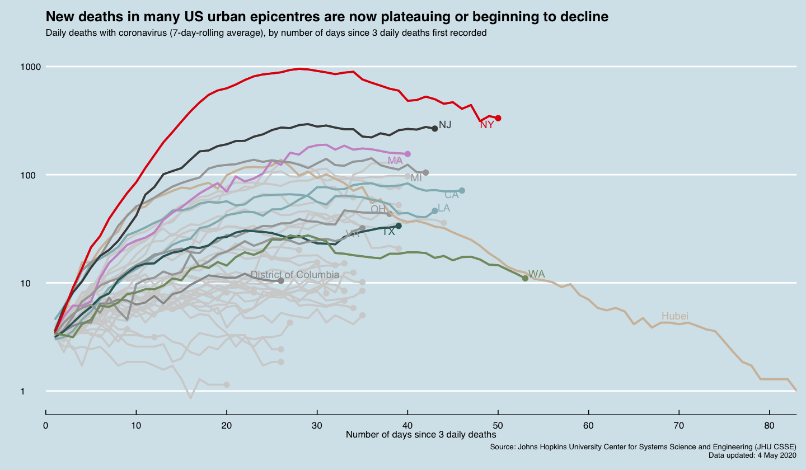

## COVID19-Timeseries-Data-Viz
This tutorial was developed for recreating two of the most classic Financial Times coronavirus trackers using JHU time series data in R. 

## Getting Started
Code for generating this chart is in this Jupyter notebook. [View Code](https://github.com/irisw0219/COVID19-Timeseries-Data-Viz/blob/master/COVID19%20Timeseries%20Data%20Visualisation%20-%20Part1.ipynb)

Code for generating this trajectory tracker is in that Jupyter notebook. [View Code](https://github.com/irisw0219/COVID19-Timeseries-Data-Viz/blob/master/COVID19%20Time%20Series%20Visualisation%20-%20Trajectory%20.ipynb)

